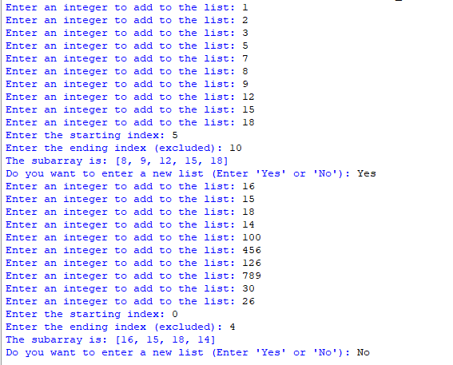

## Description
This program lets users create a fixed-size list with 10 integers and then extract a subarray by specifying starting and ending indices (excluded). Users can repeat this process with new lists as needed.
# Example

